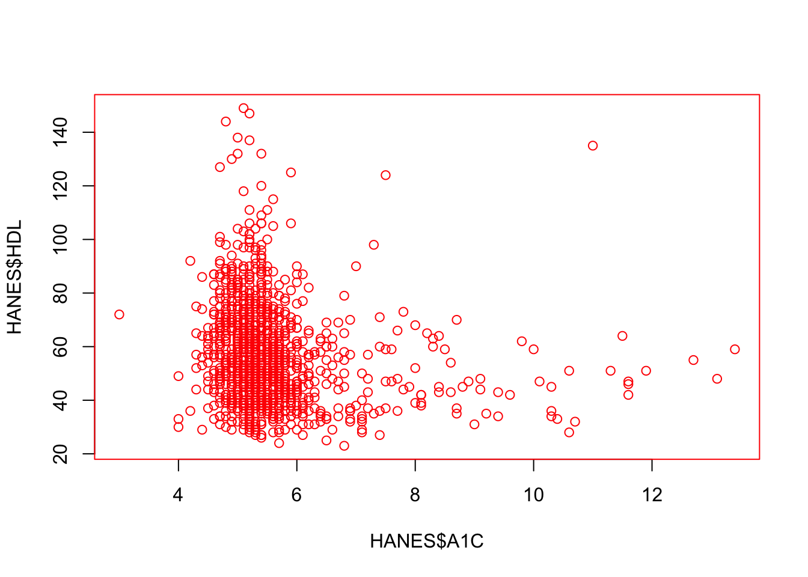
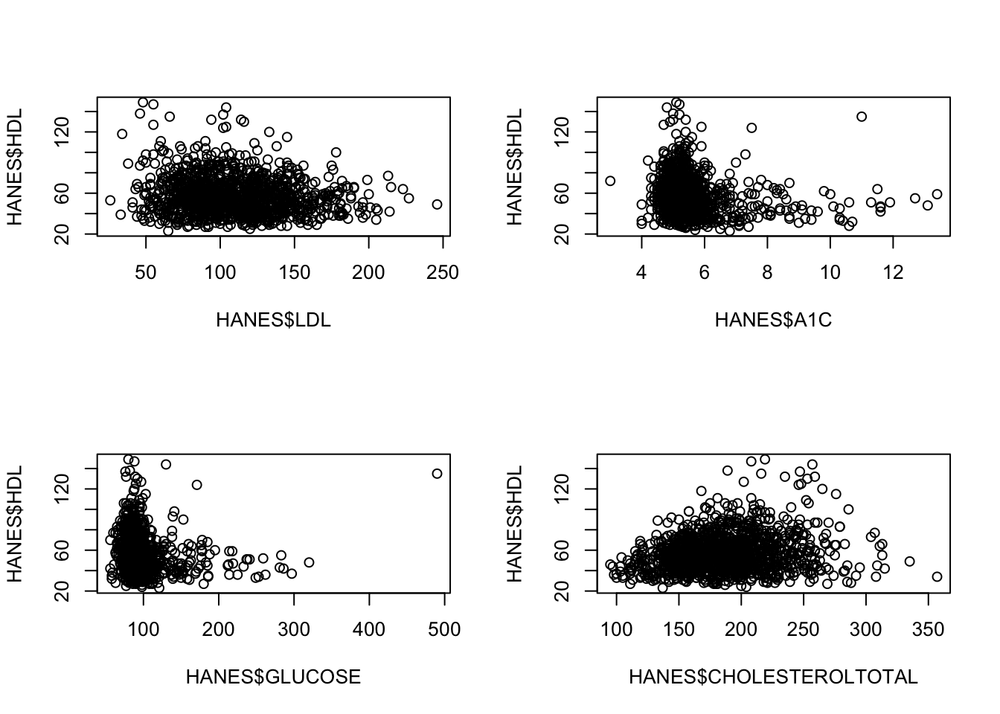
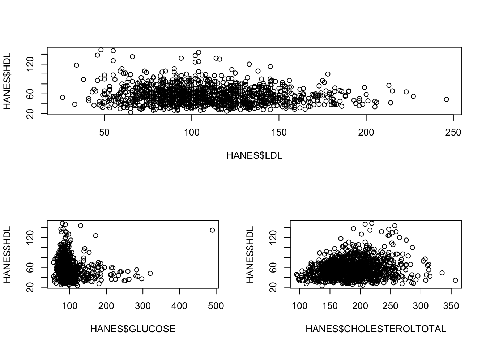
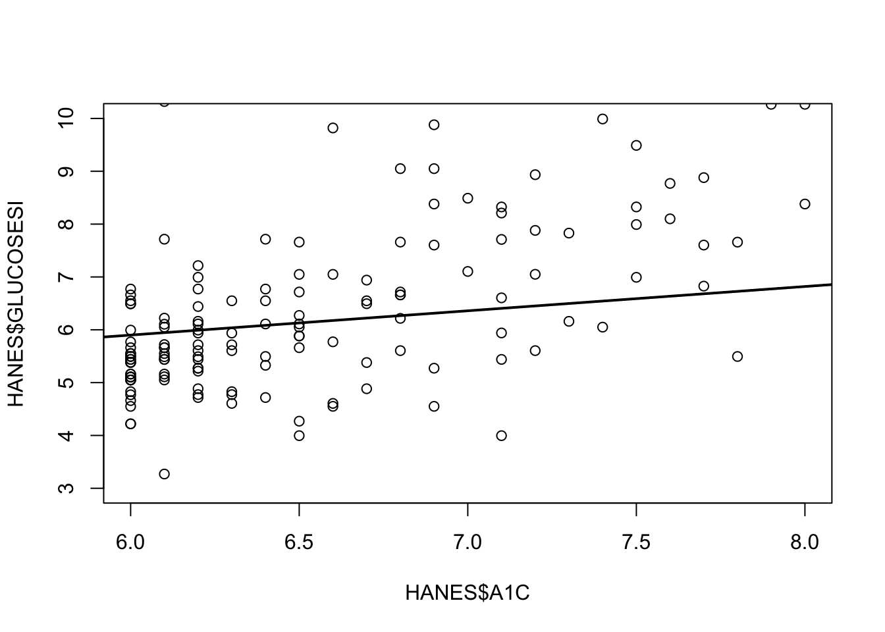

---
output:
  revealjs::revealjs_presentation:
    reveal_options:
      slideNumber: 'c/t'
  pandoc_args:
  - --slide-level
  - '2'

---

<style type="text/css">
p { text-align: left; }
h3 { /* Header 3 */
  font-size: 18px;
  font-family: "Times New Roman", Times, serif;
  color: DarkBlue;
}
</style>

<style>
    .reveal code {
    	background-color: #f5f5f5;	/* code bg color*/
    }
    .reveal .slides {
        text-align: left;
    }
    .reveal .slides section>* {
        margin-left: 0;
        margin-right: 0;
    }
    
    .reveal .slide-number {
    font-size: 20pt;
    color: #ffffff;
</style>

### R fundamentals 02: Basic Graphics in R (`r format(Sys.Date(), "%b %d, %y")`)

---

In this part of the course we will learn about basic **graphics** in R.

---

#### Graphics

R has very strong graphical capabilities - this is the primary reason why both industries and academics are interested.

* Creates plots with code
* Replication and modification is easy
* Reproducibility!
* _graphics_ package loaded by default produces great plots
* Excellent packages like _ggplot2_, _ggvis_ and _lattice_

##

##### Packages

Packages are extensions of R functionality, adding a new set of functions that are tailored to handle tasks with a common purpose. When a new package is loaded, it often happens that some of the new functions have the same name of currently loaded ones. When happens, we get a "conflict event" and R warns you and list all commands that are going to mask previously loaded ones.

Packages are loaded using the `library()` function. 

When a package is loaded, it can load other packages that it depends on.

##

##### **_graphics_** package

This package is part of the default list of loaded packages when you start R
It has many functions. Primarily `plot()` and `hist()` provide essential functionalities.

The `plot()` function is _generic_, which means:

1. Different inputs gives different plots
2. Can plot several things like vectors, linear models, kernel densities etc.


##

Before we see how the plot function works, we will first import a public health data set. We will work with HANES data set which is New York City's Health and Nutrition survey data set. For more info about HANES, click [here](http://nychanes.org/about/).

```{r eval=TRUE}
  # If needed, install RCurl package, then load the package
  # install.packages("RCurl")
  library(RCurl)
  # Import the HANES data set from GitHub; break the string into two for readability
  # (Please note this readability aspect very carefully)
  URL_text_1 <- "https://raw.githubusercontent.com/kannan-kasthuri/kannan-kasthuri.github.io"
  URL_text_2 <- "/master/Datasets/HANES/NYC_HANES_DIAB.csv"
  # Paste it to constitute a single URL 
  URL <- paste(URL_text_1, URL_text_2, sep="")
  HANES <- read.csv(text = getURL(URL))
```

##

We now observe the structure of the data.

```{r eval=TRUE}
  # Observe the structure
  str(HANES)
```

<small>Note that GENDER, AGEGROUP and HSQ_1 are integers but in fact they should be factors! So, we need to convert them to factors.</small>

##

```{r eval=TRUE}
  # Convert them to factors
  HANES$GENDER <- as.factor(HANES$GENDER)
  HANES$AGEGROUP <- as.factor(HANES$AGEGROUP)
  HANES$HSQ_1 <- as.factor(HANES$HSQ_1)
  
  # Now observe the structure
  str(HANES)
```

##

Let's plot a categorical variable, for instance gender.

##

```{r eval=TRUE}
  # Plot the factor gender
  plot(HANES$GENDER)
```

##

<br>
<span style="color:blue">**Classwork/Homework**</span>:

1. Is the above plot informative?
2. What will you do to make it more informative?
<br>

##

Let's now plot a numerical variable.

##

```{r eval=TRUE}
  # Plot a numerical variable
  plot(HANES$A1C)
```

##

Of course, we can plot two numerical variables:

##

```{r eval=TRUE}
  # Plot two numerical variables 
  # A1C - Hemoglobin percentage, UACR - Urine Albumin/Creatinine Ratio
  plot(HANES$A1C, HANES$UACR)
```

##

Note that R automatically renders them as a scatter plot and sets the axis scale based on the range of the variables 
```{r collapse=T}
min(HANES$A1C, na.rm = T); max(HANES$A1C, na.rm = T)

min(HANES$UACR, na.rm = T); max(HANES$UACR, na.rm = T)
```


However, this plot is as uninformative as the data is unevenly scattered. One can scale the data using the "ylim" argument:

##

```{r eval=TRUE}
  # Plot two numerical variables with appropriate scaling
  plot(HANES$A1C, HANES$UACR, ylim=c(0, 10))
```

##

Although the scaling is okay now, the relationship is extremely complicated. 

One of the transformations that helps us to understand relationships between the variables is the `log()` function. 

We can apply a logrithm to both variables -

##

```{r eval=TRUE}
  # Transform the data using the log function and plot the result
  plot(log(HANES$A1C), log(HANES$UACR))
```

##

We note that there are two different clusters of patients - one with low UACR values and another with high UACR values, both corresponding to a mean $log(A1C)$ of about $1.7$.

<!-- <br>
<span style="color:Blue">**Project**</span>: 

1. Explore these patients groups in detail and come up with explanations on why there are two groups. 
2. Research on A1C and UACR and how they are related. 
3. What other variables distingush these two groups?
4. Are one group of patients more diabetic than the other?

<br> -->

##

We can also plot two categorical variables. Let us plot GENDER and AGEGROUP factors. 

Lets change the texts to render something more informative (based on the HANES
[codebook](28283961_NYC-HANES_codebook_Public_V2_042618.pdf)):


```{r eval=TRUE}
  # Rename the GENDER factor for identification 
  HANES$GENDER <- factor(HANES$GENDER, labels=c("M","F"))
  # Rename the AGEGROUP factor for identification
  HANES$AGEGROUP <- factor(HANES$AGEGROUP, labels=c("20-39","40-59","60+"))
```

##

```{r eval=TRUE, fig.width = 5.5, fig.height = 4.5, fig.align = 'center'}
  # Plot GENDER vs AGEGROUP
  plot(HANES$GENDER, HANES$AGEGROUP)
```
Note that R already prints proportion as it displays the plots. The first element is the $x$-axis and the second element is the $y$-axis.

##

Now, let's switch the order:
```{r eval=TRUE, fig.width = 5.5, fig.height = 4.5, fig.align = 'center'}
# Swap AGEGROUP vs GENDER
  plot(HANES$AGEGROUP, HANES$GENDER)
```

##

Next, let's explore the `hist()` function. 
`hist()` is a short form for histogram.  
The `hist()` function:

* Visual representation of distribution
* Bins all values
* Plots frequency of bins

##

```{r setDefaultPlot, include=F}
knitr::opts_chunk$set(fig.width = 7, fig.height = 5, fig.align = 'center')
```


Here is an example to find the distribution of A1C variable for the male population. 

First select only the male population:

```{r eval=TRUE}
  # Form a logical vector consisting only the MALE gender
  HANES_MALE <- HANES$GENDER == "M"
  # Select only the records for the male population
  MALES_DF <- HANES[HANES_MALE,]
```


Now, let's make an histogram for the above selected male population:

##

```{r eval=TRUE}
  # Make an historgam
  hist(MALES_DF$A1C)
```

##

Observe that the Glycohemoglobin percentage lies between $5-6$ for most of the men (the mode). 

Note that R has also chosen the number of bins automatically. 

You can increase (or decrease) the number of bins using the "breaks" argument. 

There are other cool tools like `barplot()`, `boxplot()`, `pairs()` in the _graphics_ package. 

The _plot_ system allows to add different plots one on top of the other.

##

For example, on top of the histogram, 
let's add a vertical line represents the mean of the distribution 

```{r histWmean}
# Make an historgam
  hist(MALES_DF$A1C)
# Add a vertical line, supplying the x-axis value
  abline(v = mean(MALES_DF$A1C, na.rm = T), col="red")
```

##
<br>
<span style="color:Blue">**Classwork/Homework**</span>: 

1. Find the distribution of A1C for the female population in the above data set. Are they different?
2. Add vertical lines that indicate the boundaries of the standard error of the mean.
3. Find the distribution of A1C for three age groups in the above data set. Is there a difference? 
4. Try to find the distribution of one more numeric variable (other than A1C) for the three age-groups.
5. Try some plots with a higher number of bins in the above exercise, what happens?
<br>

##

##### Customizing plots

How does this plot look?

##

```{r eval=TRUE}
  # Plot LDL values vs HDL values
  plot(HANES$LDL, HANES$HDL)
```

## 

compared to this -

##

```{r eval=TRUE}
  # Plot GLUCOSE vs GLUCOSESI with parameters
  plot(HANES$GLUCOSE, HANES$GLUCOSESI, 
       xlab= "Plasma Glucose [mg/dL]", ylab = expression(paste("Blood Glucose SI units [", mu, "mole/L]")), 
       main = "Plasma vs Blood Glucose", type = "o", col="blue")
```

##

<br>


<span style="color:Blue">**Classwork/Homework**</span>: Check the `Hmisc::label()` function. In accordance to the graph above, think how one can leverage this function to save some typing when plotting several graphs with the same variable? Give an example.


<br>

##

To do good data science, it certainly not only helps to know correlations between the variables (in the above figure, we know blood glucose levels and plasma glucose levels are the same), but how we present the data matters!

Some plot function characteristics:

* **_xlab_**: Horizontal axis label

* **_ylab_**: Vertical axis label

* **_main_**: Plot title

* **_type_**: Plot type

* **_col_**: Plot color

##

<br>
<span style="color:Blue">**Classwork/Homework**</span>: Change the type to "l" and report the plot type. 
<br>

##

Graphical parameters are not maintained throughout a session. If you want to maintain graphical parameters, use the `par()` function. For example,

##

```{r parSetup, include = F}
knitr::opts_knit$set(global.par = TRUE)
```


```{r eval=TRUE}
  # Set the graphical parameter par's so that color red is held
  par(col="red")
  # Plot LDL vs HDL
  plot(HANES$LDL, HANES$HDL)
```

##

Now make another plot:

```{r eval=FALSE}
  # Plot Hemoglobin vs HDL
  plot(HANES$A1C, HANES$HDL)
```

{width=750px}

##

More graphical parameters:

* **_col.main_**: Color of the main title

* **_cex.axis_**: Size of the axis numbers (towards 0 is more smaller). Just like "col" parameter has variants such as "main", "cex" also has other variants - "axis" is one of them.

* **_lty_**: Specifies the line type - solid, dashed etc. (1 is a full line, 2 is dashed etc.)

* **_pch_**: Plot symbol. More than 35 types of symbols.

##

##### Multiple graphs

So far we saw single plots of data, with no combinations and layers. It may be good to plot several. We can use "mfrow" with the `par()` function.

##

```{r eval=FALSE}
  # Set the par function with mfrow to 2x2 "grid"
  par(mfrow = c(2,2))
  # Plot LDL vs HDL
  plot(HANES$LDL, HANES$HDL)
  # Plot A1C vs HDL
  plot(HANES$A1C, HANES$HDL)
  # Plot GLUCOSE vs HDL
  plot(HANES$GLUCOSE, HANES$HDL)
  # Plot CHOLESTEROLTOTAL vs HDL
  plot(HANES$CHOLESTEROLTOTAL, HANES$HDL)
```

---



---

##

<br>
<span style="color:Blue">**Classwork/Homework**</span>: Do the above exercise with "mfcol" argument. How does it plot?
<br>

##

To reset the plot to 1 figure, one can use `par(mfrow = c(1,1))`, that will get us back to normal.

##

##### The `layout()` function

Facilitates more complex plot arrangements.

##

```{r eval=FALSE}
  # Create a grid on how our figures should appear
  grid <- matrix(c(1,1,2,3), nrow=2, ncol=2, byrow=TRUE)
  # Pass it to the layout function
  layout(grid)
  # Plot LDL vs HDL
  plot(HANES$LDL, HANES$HDL)
  # Plot GLUCOSE vs HDL
  plot(HANES$GLUCOSE, HANES$HDL)
  # Plot CHOLESTEROLTOTAL vs HDL
  plot(HANES$CHOLESTEROLTOTAL, HANES$HDL)
  # Reset the layout
  layout(1)

```

---



---

##

**Tip**: Resetting everytime might be too tedious. A trick is to assign the old setting to an object and reuse it when necessary:

##

```{r eval=TRUE, warning=FALSE}
  # Assign the old parameters to an object
  old_parameters <- par()
  # Change to new parameters
  par(col="red")
  plot(HANES$LDL, HANES$HDL)
```


##

```{r eval=TRUE, warning=FALSE}
  # Reset to old parameters
  par(old_parameters)
  # Test the original settings
  plot(HANES$LDL, HANES$HDL)
```


##

Stacking graphical elements. It's a great way of adding more information to the plots.

```{r eval=FALSE, warning=FALSE}
  # Plot A1C vs GLUCOSESI
  plot(HANES$A1C, HANES$GLUCOSESI, xlim=c(6,8), ylim=c(3,10))
  # Using linear fit model. 
  # Note: `lm()` function will return a vector of coefficients for the fit
  lm_glucose_SI <- lm(HANES$A1C ~ HANES$GLUCOSESI)
  # Stack the linear model on top of the plot with line width 2 (specified by `lwd` argument)
  abline(coef(lm_glucose_SI), lwd = 2)
```

---



##

<br>
<span style="color:Blue">**Classwork/Homework**</span>: Make a plot and add elements through the functions `points()`, `lines()`, `segments()` and `text()`.
<br>

##


#### Selected materials and references

[An Introduction to R](https://cran.r-project.org/doc/manuals/R-intro.pdf)  
[Become a plot() master](https://www.datacamp.com/community/tutorials/15-questions-about-r-plots)  

---